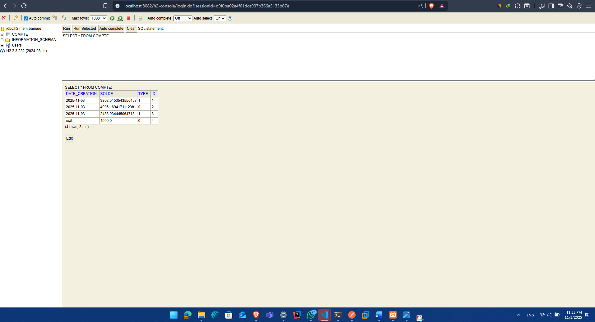

# Projet JAX-RS - API REST Banque

*Figure 1 : Réponse XML lors de la récupération de tous les comptes*

*Figure 2 : Création d'un nouveau compte en utilisant le format XML*

*Figure 3 : Récupération d'un compte par son ID*

### Accès à la console H2

*Figure 4 : Interface de la console H2 pour l'accès à la base de données*
